

# Augusto Danna

Quant Developer & Algorithmic Trader building AI-native software. 7 years validating trading strategies with real capital taught me to distrust anything that only looks good on the data I've already seen — I bring that same discipline to building and evaluating AI systems.

I design and ship products end to end, alone, using AI-assisted development (Claude Code) as my primary way of building.

---

## Public repos

- **[ALGOCODE](https://github.com/ADanna-PIECE/ALGOCODE)** — Python backtesting infrastructure: walk-forward validation, friction-cost auditing, portfolio correlation analysis, and an ETL pipeline for high-frequency OHLCV data.
- **[MyPage](https://github.com/ADanna-PIECE/MyPage)** — source for my portfolio site.

---

## Also shipped — private, client work in production

Source is private (client work and personal financial data), shown here so you can see what they do.

### 🏭 Fábrica de Crecimiento
Multi-tenant agentic content pipeline for a real marketing agency. It scrapes what's working in a client's niche, transcribes and reasons over it with an LLM (Gemini), and generates a full omnichannel campaign (Reel script, X thread, carousel, newsletter) — held at a human-approval gate before anything ships. Every generated slide is validated against layout rules in code, not trusted from the model's output directly — four layout roles (cover, body, highlight, close), each with its own composition rules.

  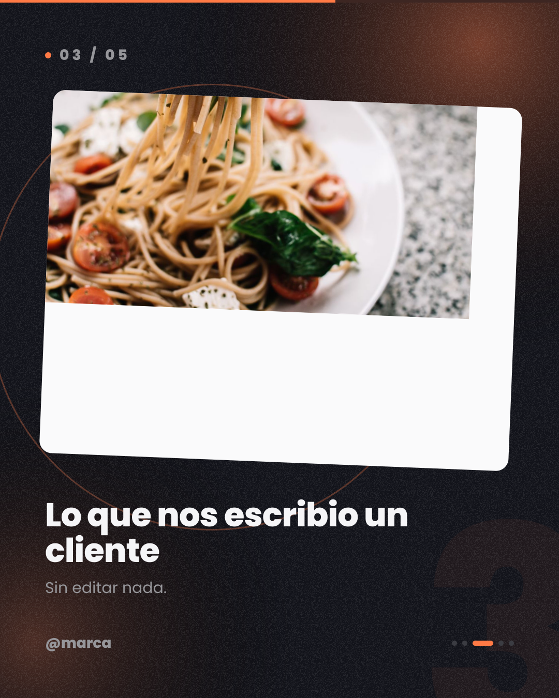
  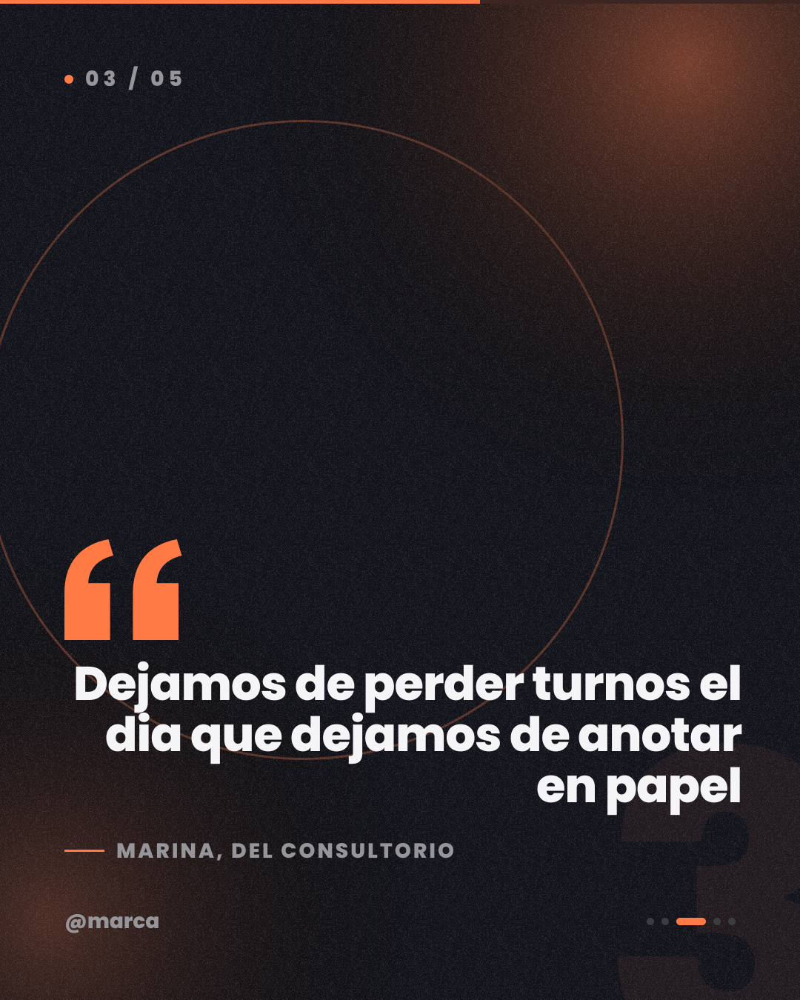
  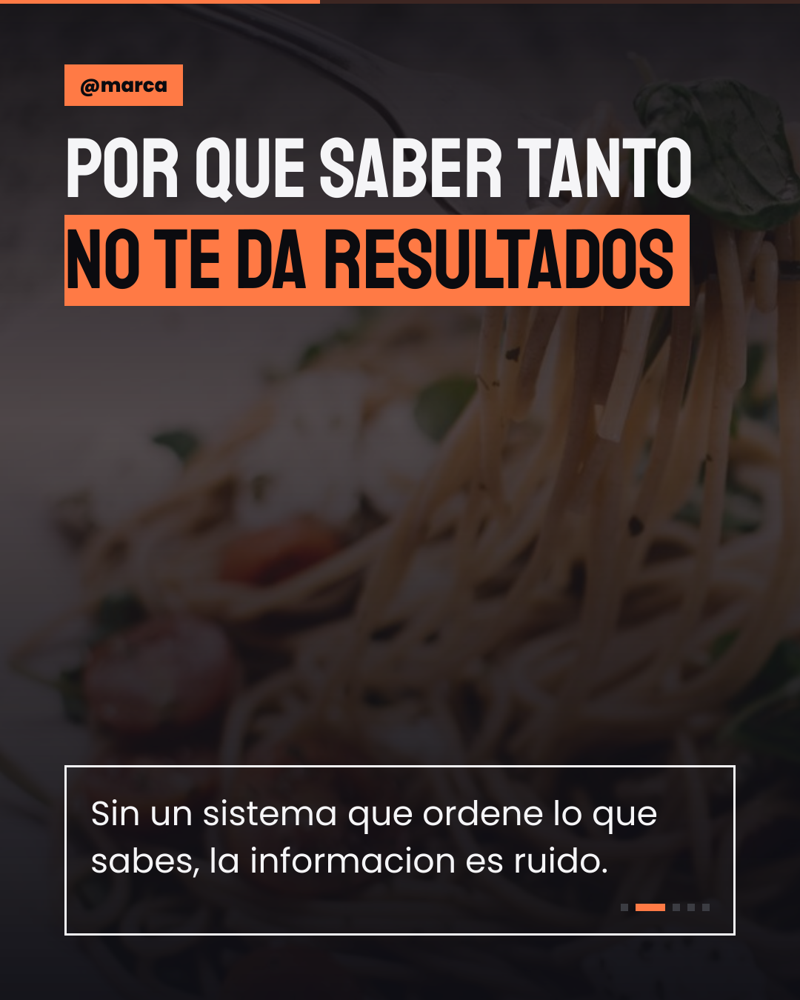

### 📊 Trading Performance Tracker (TradeLog)
A trading journal with a Claude-based module ("Análisis con IA") that analyzes behavioral patterns across my own P/L history — calendar view, equity curve, and stats broken down by day/hour/setup.

  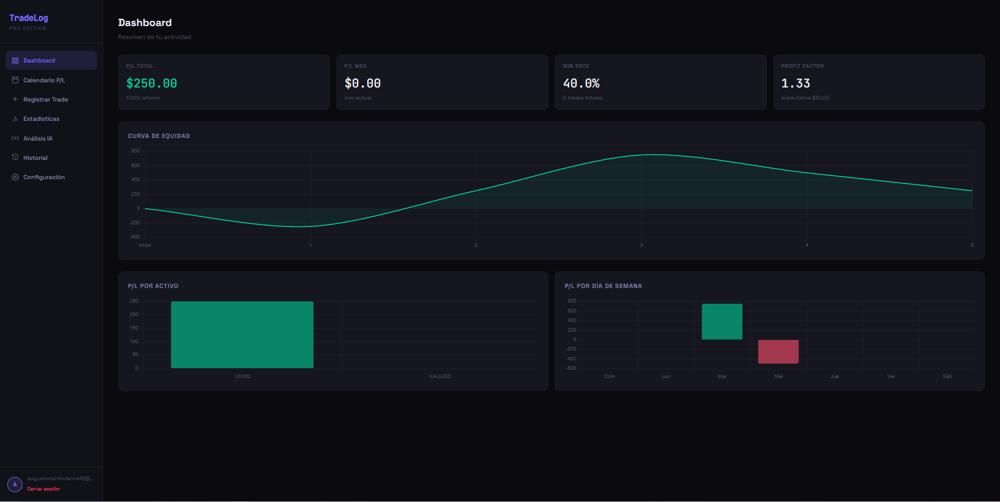
  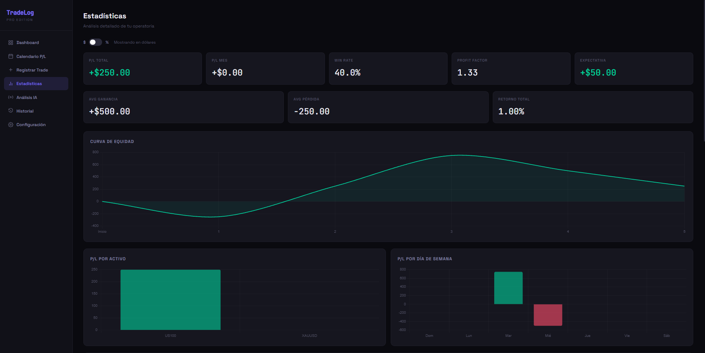
  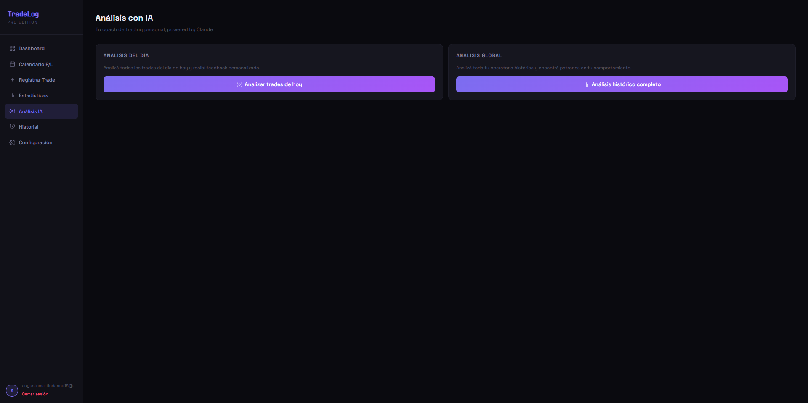

### 🔍 Analizador de Trades
Hotkey-triggered tool (F9) that captures the screen, uses Gemini Vision to extract trade data marked on the chart, and logs it straight into a local dashboard — turns manual journaling into one click. Segments every strategy separately and computes institutional-grade stats (SQN, Sharpe, Sortino, Calmar, Kelly %) per instrument.

  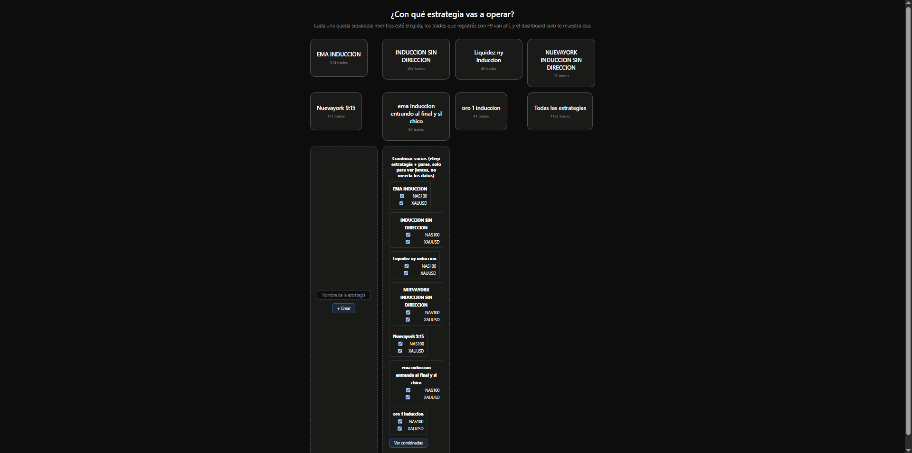
  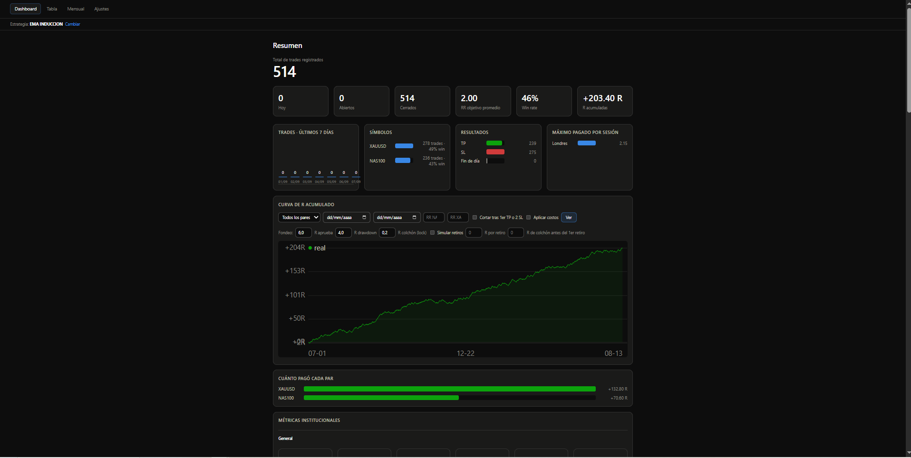
  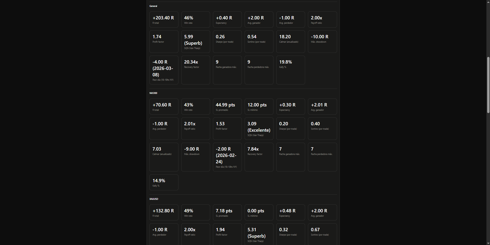

### 🥗 NutriCam / FitCam ("Brócolix")
A pair of health apps (Next.js/Firebase) under the Brócolix brand. NutriCam identifies meals from a photo and estimates nutritional value with vision AI, with an in-app AI coach; FitCam generates workout routines and guides recovery.

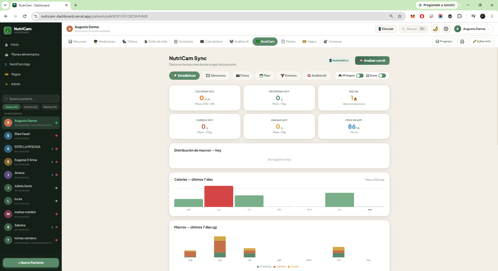

  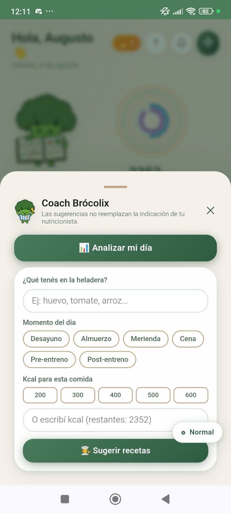
  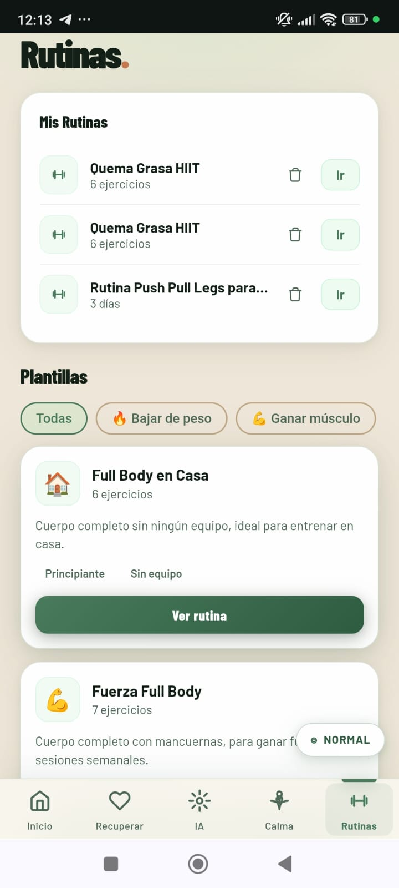
  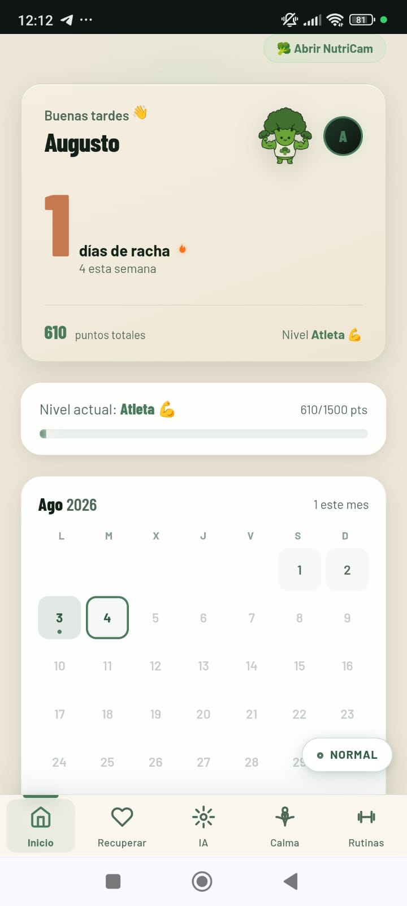

---

More detail on each project, live demos, and how I work: **[my-page-chi-eight.vercel.app](https://my-page-chi-eight.vercel.app/en)**

