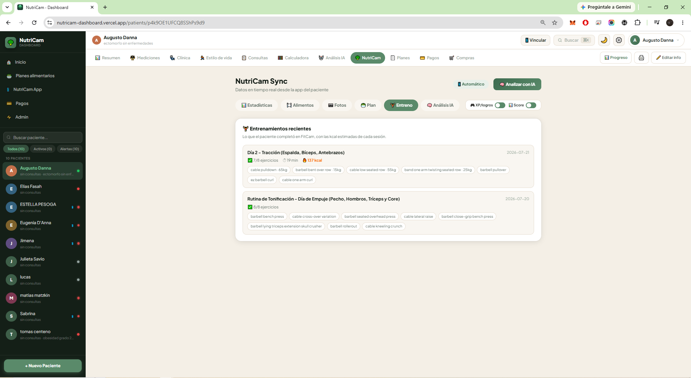

# Augusto Danna

Quant Developer & Algorithmic Trader building AI-native software. 7 years validating trading strategies with real capital taught me to distrust anything that only looks good on the data I've already seen — I bring that same discipline to building and evaluating AI systems.

I design and ship products end to end, alone, using AI-assisted development (Claude Code) as my primary way of building.

---

### Public here

- **[ALGOCODE](https://github.com/ADanna-PIECE/ALGOCODE)** — Python backtesting infrastructure: walk-forward validation, friction-cost auditing, portfolio correlation analysis, and an ETL pipeline for high-frequency OHLCV data.
- **[MyPage](https://github.com/ADanna-PIECE/MyPage)** — source for my portfolio site.

### Also shipped (private — client/production work)

**Fábrica de Crecimiento** — a multi-tenant agentic content pipeline for a marketing agency: scrapes a niche, transcribes and reasons over content with an LLM (Gemini), generates a full omnichannel campaign, and holds everything at a human-approval gate before it ships.

**Trading Performance Tracker** — a trading journal with a Claude-based module that analyzes behavioral patterns across P/L history.

**Analizador de Trades** — a Gemini Vision pipeline that extracts structured trade data from screenshots in real time.

**NutriCam / FitCam** — a pair of health apps (Next.js/Firebase) using vision AI to identify meals from photos and generate fitness routines.

  
  

More detail on each project, live demos, and how I work: **[my-page-chi-eight.vercel.app](https://my-page-chi-eight.vercel.app/en)**
